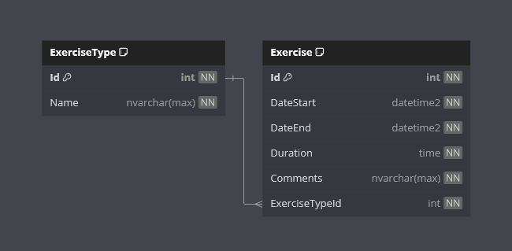

<h1>Exercise Tracker</h1>

Welcome to the Exercise Tracker App!

This is a .NET project designed to demonstrate the repository pattern solution for data persistence.

## Requirements

- [x] Application must be able to record exercise data.
- [x] The model for the exercise class must have at least the following properties:
  - [x] Id INT
  - [x] DateStart DateTime
  - [x] DateEnd DateTime
  - [x] Duration TimeSpan
  - [x] Comments string
- [x] The application must have at least the following classes:
    - [x] UserInput
    - [x] ExerciseController
    - [x] ExerciseService
    - [x] ExerciseRepository
- [x] Dependency injection must be used to access the repository from the controller.

### Additional Requirements

- [x] Application contains two types of exercises.

## Features

- **Exercises**

    View a list of exercises. Log a new exercise, update or delete an existing exercise.

- **Database Seeding**

    Set `SeedDatabase` to `true` in the console application project's appsettings.json file if you wish to generate mocked up seed data on initial database creation.

## Getting Started

**IMPORTANT!**

I have already created and staged the InitialCreate database migration in the repo.

Entity Framework will handle the database creation for you.

The console application will handle the performing of any created database migrations.

### Prerequisites

- .NET 8 SDK installed on your system.
- A code editor like Visual Studio or Visual Studio Code
- SQL Server
- SQL Server Management Studio (SSMS)

### Installation

1. Clone the repository:
    - `git clone https://github.com/cjc-sweatbox/exercise-tracker.git`

2. Configure the application:
    - Navigate to the `.\src\ExerciseTracker.ConsoleApp\` directory.
    - Update the `appsettings.json` file with your database connection string.

3. Build the application:
    - Navigate to the `.\src\` directory.
    - `dotnet build`

### Running the Application

1. Run the console application using the .NET CLI:
    - Navigate to the `.\src\ExerciseTracker.ConsoleApp\` directory.
    - `dotnet run`

### Usage

- **Database Migrations**:
On initial startup, any outstanding database migrations will be performed.
- **Database Seeding**:
On initial startup and if configured to, the database will be seeded with mock data.
- **Main Menu**:
Select an option to perform.
- **View Exercises**:
Displays all stored exercise data.
- **Log an Exerciset**:
Record the type, start time, end time, and any commentss for an exercise to add to the database.
- **Update Exercise**:
Select an exercise to update, and record the updated exercise details to update in the database.
- **Delete Exercise**:
Select an exercise to delete from the database.
- **Close Application**:
Closes the application.

## How It Works

- **Console Application**:
Display and navigation is aided by the [Spectre Console](https://spectreconsole.net/) library.
- **Data Storage**:
An SQL Server database is used to store the application data.
- **Data Access**:
Code-First Entity Framework is used for the database access methods.
- **Data Seeding**:
If configured, a set of mock shifts will be added to the databaseusing the [Bogus](https://github.com/bchavez/Bogus) library.
- **Report Display**:
Uses the Tables class provided by the [Spectre Console](https://spectreconsole.net/) library to display structured and formatted tables.

## Database

## Contributing

Contributions are welcome!
Please fork the repository and create a pull request with your changes.
For major changes, please open an issue first to discuss what you would like to change.

## License

This project is licensed under the MIT License.
See the [LICENSE](./LICENSE) file for details.

## Contact

For any questions or feedback, please open an issue.

---
***Happy Exercise Tracking!***
